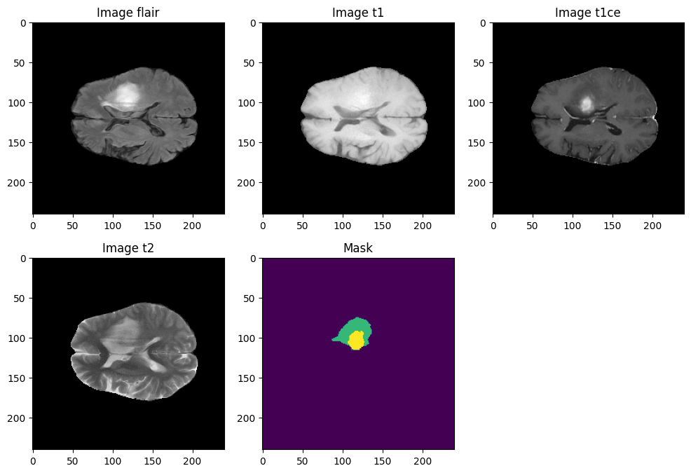
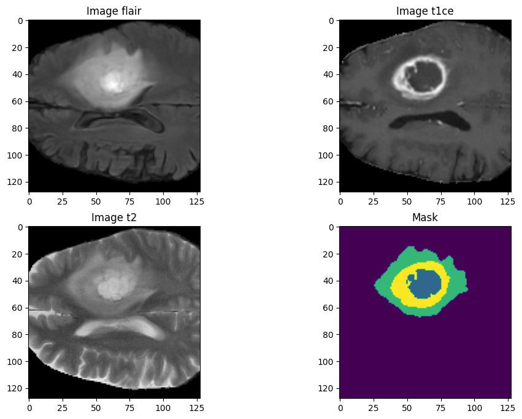
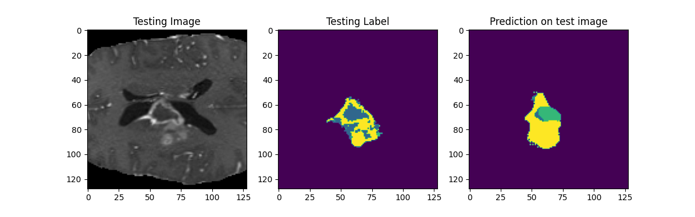
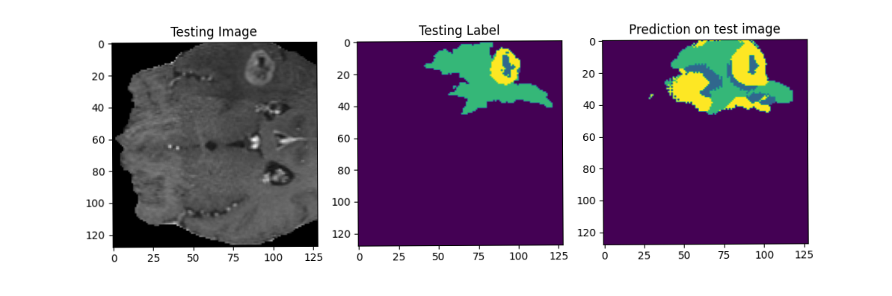
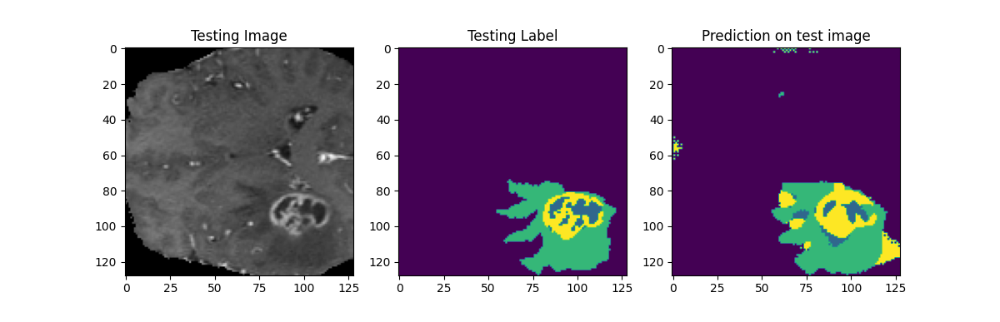
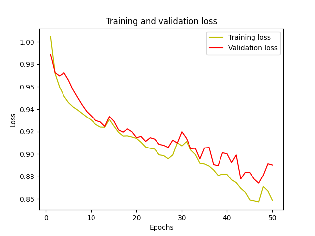
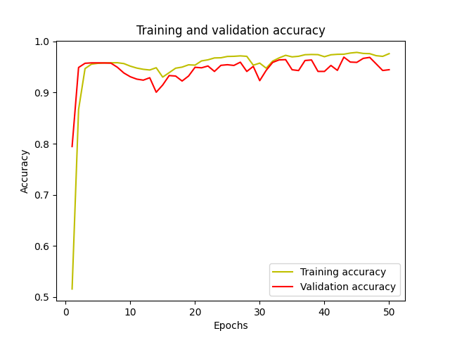
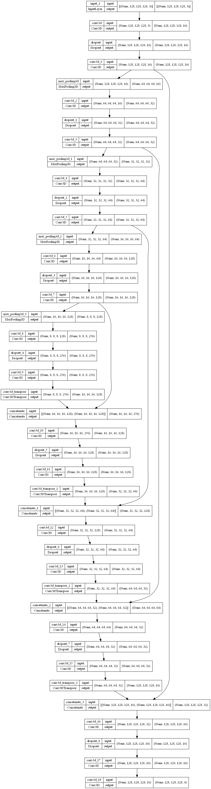

# Brain Tumor Segmentation using 3D-UNET

**Figure 1:** Sample Image With all 4 Channels and a mask

This project involves 3D segmentation of brain tumors from the BraTS2020 dataset using TensorFlow, 3D-UNET architecture, and the `segmentation-model-3D` package. The BraTS2020 dataset is approximately `40 GB in size`, comprising both training (~30 GB) and validation sets (~10 GB). In this project, only the training set is utilized and split into training and validation subsets.

## Project Overview

The goal of this project is to perform 3D segmentation of brain tumors from medical imaging data obtained through MRI scans. The project's main steps include:

1. Reading `.nii` files using the `nibabel` library.
2. Normalizing each image to scale pixel values between 0 and 1.
3. Changing mask pixel values (labels) from 4 to 3 (as the original labels are 0, 1, 2, 4).
4. Cropping unnecessary surrounding regions to focus on the relevant brain region.
5. Combining T1ce, T2, and FLAIR modalities into a single multichannel image.
6. Cropping the combined image to a fixed size of 128x128x128x4.
7. Save each multichannel image as `.npy` format
8. By this stage size of dataset reduced from `~30 GB` to `~26 GB`
9. Due to resource limitation traininig was done just for 50 epochs on 20 3D images (~ 1GB). The main pupose was to build the model the results displayed were generated by the model trained on 50 epochs.

**Figure 2:** Cropped Image With all 3 effective Channels (FLAIR, T1, T1CE, T2) and a mask

**Figure 3:** A fixed number of random slices of test image_21 (merged 3 channels) With prediction and ground truth

**Figure 3:** A fixed number of random slices of test image_28 (merged 3 channels) With prediction and ground truth

**Figure 3:** A fixed number of random slices of test image_82 (merged 3 channels) With prediction and ground truth

## Dataset and Modalities

The BraTS2020 dataset provides multimodal brain scans in NIfTI format (.nii.gz), which is commonly used in medical imaging to store brain imaging data obtained using MRI. The dataset includes the following modalities:

- **T1**: T1-weighted native image, acquired in sagittal or axial 2D with 1–6 mm slice thickness.
- **T1c**: T1-weighted contrast-enhanced (Gadolinium) image, acquired with a 3D acquisition and 1 mm isotropic voxel size for most patients.
- **T2**: T2-weighted image, acquired in axial 2D with 2–6 mm slice thickness.
- **FLAIR**: T2-weighted FLAIR image, acquired in axial, coronal, or sagittal 2D with 2–6 mm slice thickness.

## Implementation Details

The project utilizes TensorFlow as the deep learning framework and leverages the 3D-UNET architecture for accurate segmentation of brain tumors. The `segmentation-model-3D` package is employed for facilitating 3D segmentation tasks. `segmentation-model-3D` package has been used or computing `DiceLoss` and `CategoicalFocalLoss`

## Getting Started

1. Clone this repository.
2. Install the necessary packages by running `pip install -r requirements.txt`.
3. Download the BraTS2020 dataset and organize it as needed.
4. Modify the data preprocessing steps as required in `data_preparation.py`.
5. Run the training script with `python main.py -train` or `python main.py -prepare-data`.

*NOTE:* _if there is any issue in running the code via main.py file simple copy the .py files from research folder and keep it in root folder and run one by one._

## Model Architechture

## Acknowledgments

This project makes use of the BraTS2020 dataset and is built on top of the segmentation techniques provided by TensorFlow, 3D-UNET, and the `segmentation-model-3D` package.
